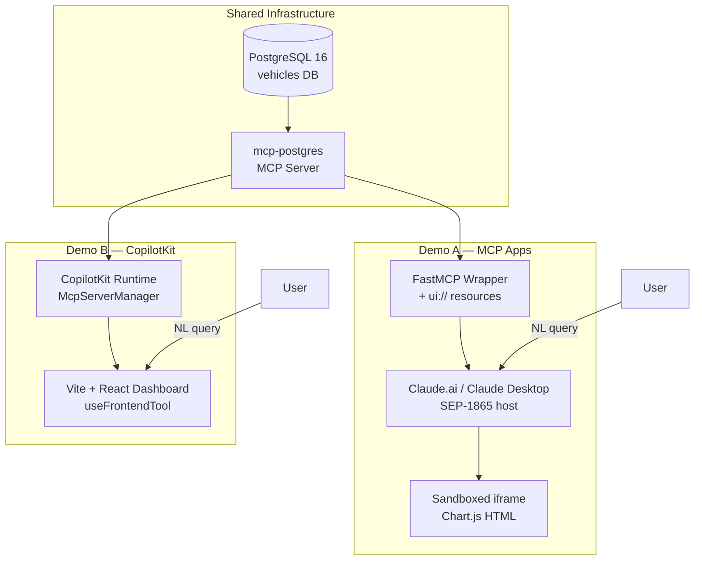
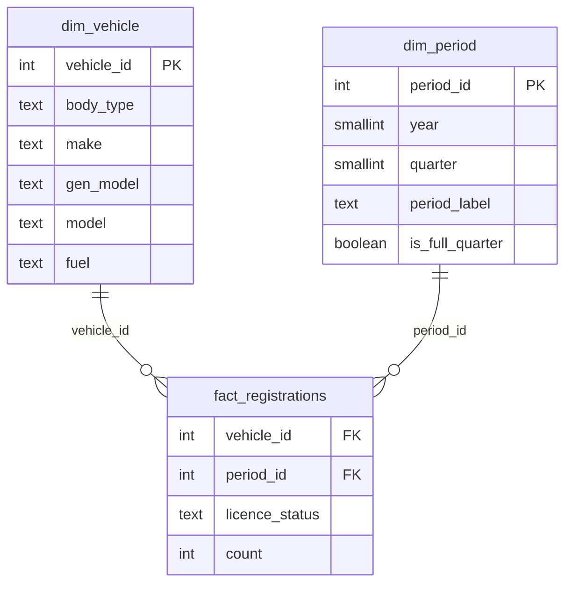

# vehicle-genui-poc

> A side-by-side comparison of **MCP Apps** (SEP-1865) and **CopilotKit Static Generative UI**
> on UK vehicle registration data. Two demos, one database, one comparison document.

[](./CHANGELOG.md)
[](./docs/ROADMAP.md)

---

## What this is

This PoC explores two approaches to Generative UI — where an AI agent drives what the
interface shows, in real time, from a natural language query. Both demos query the same
PostgreSQL database (DVLA VEH0120 UK vehicle registrations) via the standard `mcp-postgres`
MCP server. No custom query tools. No bespoke agent. Claude writes the SQL itself.

The only difference is the rendering surface:
- **Demo A** — charts appear inside Claude.ai as sandboxed iframes (MCP Apps)
- **Demo B** — charts appear in a Vite + React dashboard (CopilotKit + AG-UI)

See [`docs/COMPARISON.md`](./docs/COMPARISON.md) for the full findings.

---

## Architecture



---

## Database Schema



---

## Quick Start

Prerequisites: Docker, Python 3.13+, Node.js 22+, `uv`, `pnpm`

```bash
# 1. Set up your local env file (defaults are fine for local dev)
cp .env.example .env

# 2. Start the database
docker compose up -d

# 3. Apply the schema
docker compose exec -T db psql -U postgres -d vehicles < src/etl/schema.sql

# 4. Create the Python venv and install ETL deps
uv venv .venv --python 3.14
uv pip install -r src/etl/requirements.txt

# 5. Load the data (place df_VEH0120_GB.csv in data/ first).
#    First run takes ~35 min on Docker Desktop / Windows (one-time onboarding cost);
#    subsequent runs return in ~3 s via fast-skip. To force a reload:
#      docker compose exec db psql -U postgres -d vehicles -c 'TRUNCATE fact_registrations;'
uv run python src/etl/etl.py

# 6. Demo A — MCP Apps (v0.2.0)
#    Full walkthrough: src/demo-a-mcp-apps/README.md
#      a. Apply the read-only role (one-time, idempotent):
#           Windows: Get-Content src/demo-a-mcp-apps/setup-readonly-role.sql | docker exec -i vehicle-agui-poc-db-1 psql -U postgres -d vehicles
#           macOS/Linux: cat src/demo-a-mcp-apps/setup-readonly-role.sql | docker exec -i vehicle-agui-poc-db-1 psql -U postgres -d vehicles
#      b. cd src/demo-a-mcp-apps && npm install && npm run build && npm run serve
#      c. Merge claude-desktop-config.json into %APPDATA%\Claude\claude_desktop_config.json (Windows)
#         or ~/Library/Application Support/Claude/claude_desktop_config.json (macOS)
#      d. Paste system-prompt.md into Claude Desktop → Settings → Profile → Custom instructions
#      e. Quit and restart Claude Desktop (tray icon Quit)

# 7. Demo B — start the dashboard
cd src/demo-b-copilotkit/frontend && pnpm install && pnpm dev
```

---

## Example Queries (both demos)

- "Fuel breakdown for Cars in 2024"
- "EV growth trend since 2015"
- "Top 10 makes by licensed vehicles"
- "Licensed vs SORN for motorcycles over time"
- "Which fuel type grew fastest in the last 5 years?"

---

## Project Navigation

| Document | Purpose |
|---|---|
| [`docs/PRD.md`](./docs/PRD.md) | Product requirements and success criteria |
| [`docs/ROADMAP.md`](./docs/ROADMAP.md) | Milestones and issue tracker |
| [`docs/COMPARISON.md`](./docs/COMPARISON.md) | Final comparison findings |
| [`CHANGELOG.md`](./CHANGELOG.md) | Version history |
| [`.specify/constitution.md`](./.specify/constitution.md) | Non-negotiable project principles |

---

## Demos

| Demo | Surface | Status | README |
|------|---------|--------|--------|
| Demo A — MCP Apps | Charts as sandboxed iframes inside Claude Desktop (SEP-1865) | v0.2.0 — in progress | [`src/demo-a-mcp-apps/README.md`](./src/demo-a-mcp-apps/README.md) |
| Demo B — CopilotKit | Charts in a Vite + React dashboard (AG-UI) | planned — v0.3.0 | `src/demo-b-copilotkit/README.md` (coming soon) |

---

## Dataset

DVLA VEH0120 — UK licensed and SORN vehicles by make, model, fuel type, body type,
and quarter. ~240k source rows → ~19M fact rows after ETL. Coverage: 1994 Q4 → 2025 Q2.
