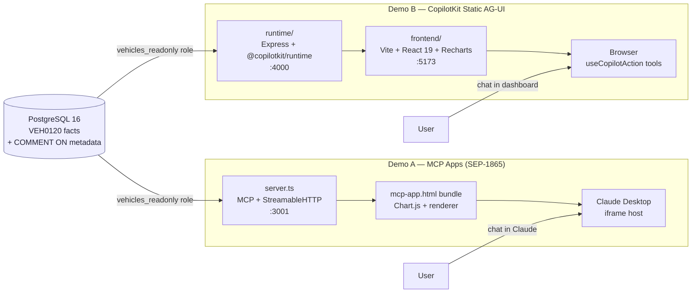
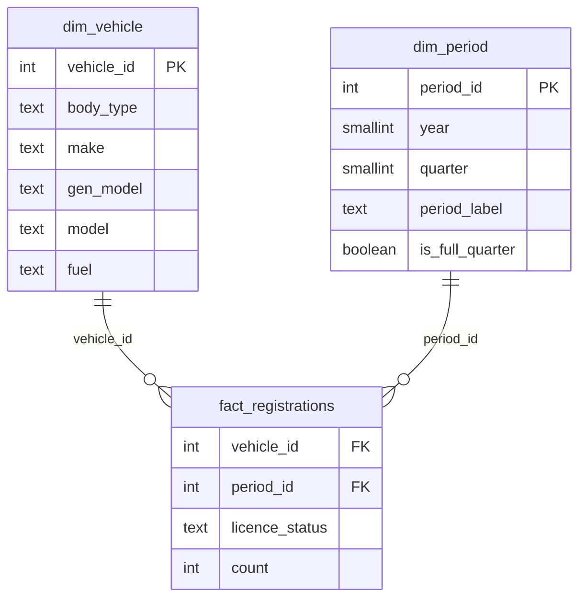

# vehicle-genui-poc

> A side-by-side comparison of **MCP Apps** (SEP-1865) and **CopilotKit Static Generative UI**
> on UK vehicle registration data. Two demos, one database, one comparison document.

[](./CHANGELOG.md)
[](./docs/ROADMAP.md)

---

## What this is

This PoC explores two approaches to Generative UI — where an AI agent drives what the
interface shows, in real time, from a natural language query. Both demos query the same
PostgreSQL database (DVLA VEH0120 UK vehicle registrations) through the same hardened
read-only role, exposing exactly one tool to the LLM: `query_vehicles({ sql })`. No NL→SQL
helpers. No per-question templates. The LLM writes the SQL itself.

The only difference is the rendering surface:
- **Demo A** — charts appear inside **Claude Desktop** as sandboxed iframes (MCP Apps, SEP-1865)
- **Demo B** — charts appear in a **Vite + React dashboard** (CopilotKit Static AG-UI)

See [`docs/COMPARISON.md`](./docs/COMPARISON.md) for the full findings.

---

## Architecture



---

## Database Schema



---

## Quick Start

Prerequisites: Docker, Python 3.13+, Node.js 22+, `uv`, `pnpm`

```bash
# 1. Set up your local env file (defaults are fine for local dev)
cp .env.example .env

# 2. Start the database
docker compose up -d

# 3. Apply the schema
docker compose exec -T db psql -U postgres -d vehicles < src/etl/schema.sql

# 4. Create the Python venv and install ETL deps
uv venv .venv --python 3.14
uv pip install -r src/etl/requirements.txt

# 5. Load the data (place df_VEH0120_GB.csv in data/ first).
#    First run takes ~35 min on Docker Desktop / Windows (one-time onboarding cost);
#    subsequent runs return in ~3 s via fast-skip. To force a reload:
#      docker compose exec db psql -U postgres -d vehicles -c 'TRUNCATE fact_registrations;'
uv run python src/etl/etl.py

# 6. Demo A — MCP Apps (v0.2.0)
#    Full walkthrough: src/demo-a-mcp-apps/README.md
#      a. Apply the read-only role (one-time, idempotent):
#           Windows: Get-Content src/demo-a-mcp-apps/setup-readonly-role.sql | docker exec -i vehicle-agui-poc-db-1 psql -U postgres -d vehicles
#           macOS/Linux: cat src/demo-a-mcp-apps/setup-readonly-role.sql | docker exec -i vehicle-agui-poc-db-1 psql -U postgres -d vehicles
#      b. cd src/demo-a-mcp-apps && npm install && npm run build && npm run serve
#      c. Merge claude-desktop-config.json into %APPDATA%\Claude\claude_desktop_config.json (Windows)
#         or ~/Library/Application Support/Claude/claude_desktop_config.json (macOS)
#      d. Paste system-prompt.md into Claude Desktop → Settings → Profile → Custom instructions
#      e. Quit and restart Claude Desktop (tray icon Quit)

# 7. Demo B — start the dashboard (v0.3.0)
#    Full walkthrough: src/demo-b-copilotkit/README.md
#      a. cp src/demo-b-copilotkit/runtime/.env.example src/demo-b-copilotkit/runtime/.env
#         and add ANTHROPIC_API_KEY=sk-...
#      b. cd src/demo-b-copilotkit && pnpm install
#      c. In one terminal:  pnpm --filter runtime dev   (Express runtime on :4000)
#      d. In another:       pnpm --filter frontend dev  (Vite on :5173)
#      e. Open http://localhost:5173 — chat is the bottom-right popup
```

---

## Demo Script

A step-by-step walkthrough for showing both demos to an audience. Total
runtime ~10 minutes once the data is loaded. Use the same five questions
in both demos so the audience can compare the two surfaces directly.

### Prerequisites (do once before the talk)

1. Database loaded — Quick Start steps 1–5 above.
2. Read-only role applied —
   ```bash
   docker exec -i vehicle-agui-poc-db-1 psql -U postgres -d vehicles \
     < src/demo-a-mcp-apps/setup-readonly-role.sql
   ```
3. Demo A built — `cd src/demo-a-mcp-apps && npm install && npm run build`
4. Demo B installed — `cd src/demo-b-copilotkit && pnpm install`
5. Claude Desktop wired per `src/demo-a-mcp-apps/README.md`
   (config path varies by Claude install — note the MSIX/Microsoft Store
   sandboxed location in that README).
6. `ANTHROPIC_API_KEY` set in `src/demo-b-copilotkit/runtime/.env`.

### Step 1 — Set the stage (1 min)

Open `docs/COMPARISON.md` §2 (the control-model table). Talking point:
*"Same database, same SQL tool, same prompt — only the rendering surface
changes. Let's see what that means in practice."*

### Step 2 — Demo A: MCP Apps inside Claude Desktop (4 min)

Start the server:

```bash
cd src/demo-a-mcp-apps && npm run serve
```

Open Claude Desktop. Ask the **golden-path questions** in order:

| # | Question | Talking point |
|---|---|---|
| 1 | *Fuel breakdown for cars in 2024* | "Donut renders **inside Claude** — no browser. The HTML bundle is a `ui://` resource served by our MCP server." |
| 2 | *EV growth trend since 2015* | "Line chart with area fill. Notice the suggestion chips under the chart — clicking one calls `app.sendMessage()` and Claude responds as if you typed it." |
| 3 | *Top 10 makes by licensed vehicles* | "Bar chart, top row = FORD. Watch the chips offer a quarterly trend for FORD specifically." |
| 4 | *Licensed vs SORN for motorcycles over time* | "Two-series line. The LLM wrote a JOIN over `dim_vehicle.body_type='Motorcycle'`." |
| 5 | *Which fuel type grew fastest in the last 5 years?* | "Table fallback when there's no obvious chart shape. The renderer's column-shape ladder picks `table` automatically." |

Talking point: *"We shipped one Express server (~232 lines) and one
self-contained HTML bundle. We don't host an LLM — Claude does."*

### Step 3 — Demo B: CopilotKit dashboard (4 min)

In two terminals:

```bash
# terminal 1
cd src/demo-b-copilotkit && pnpm --filter runtime dev
# terminal 2
cd src/demo-b-copilotkit && pnpm --filter frontend dev
```

Open <http://localhost:5173>. The dashboard has three empty panels and a
chat popup. Click the **golden-path query chips** at the top in order, or
re-type the same five questions from Step 2.

Talking points per question:
- "Same SQL tool — `query_vehicles({ sql })`. Same schema. Same prompt."
- "Charts are **Recharts** in your React tree. Inspect the DOM — they're
  normal divs."
- "We're paying for the Anthropic API call directly. Demo A spent the
  user's Claude tokens."
- "Edit `FuelBreakdownChart.tsx` while it's running — Vite HMR. Try the
  same with the Demo A bundle."

### Step 4 — Side-by-side reflection (1 min)

Pull up `docs/COMPARISON.md` §6 (Community recommendation). Read it. Invite
questions.

### If something breaks

- **Claude says "vehicles relation not found"** → schema cheatsheet didn't
  load. Check Claude restarted after server restart. See
  CHANGELOG entry on schema-first instructions.
- **Demo A iframe shows "There was a problem displaying content"** → URI
  cache. Bump `mcp-app.vN.html` in `server.ts`, rebuild, restart.
- **Demo B chat returns 404** → Anthropic adapter / model id mismatch in
  `runtime/src/copilotkit.ts`. See `src/demo-b-copilotkit/README.md`
  troubleshooting.

---

## Example Queries (both demos)

- "Fuel breakdown for Cars in 2024"
- "EV growth trend since 2015"
- "Top 10 makes by licensed vehicles"
- "Licensed vs SORN for motorcycles over time"
- "Which fuel type grew fastest in the last 5 years?"

---

## Project Navigation

| Document | Purpose |
|---|---|
| [`docs/PRD.md`](./docs/PRD.md) | Product requirements and success criteria |
| [`docs/ROADMAP.md`](./docs/ROADMAP.md) | Milestones and issue tracker |
| [`docs/COMPARISON.md`](./docs/COMPARISON.md) | Final comparison findings |
| [`CHANGELOG.md`](./CHANGELOG.md) | Version history |
| [`.specify/constitution.md`](./.specify/constitution.md) | Non-negotiable project principles |

---

## Demos

| Demo | Surface | Status | README |
|------|---------|--------|--------|
| Demo A — MCP Apps | Charts as sandboxed iframes inside Claude Desktop (SEP-1865) | ✅ v0.2.0 | [`src/demo-a-mcp-apps/README.md`](./src/demo-a-mcp-apps/README.md) |
| Demo B — CopilotKit | Charts in a Vite + React dashboard (Static AG-UI) | ✅ v0.3.0 | [`src/demo-b-copilotkit/README.md`](./src/demo-b-copilotkit/README.md) |

---

## Dataset

DVLA VEH0120 — UK licensed and SORN vehicles by make, model, fuel type, body type,
and quarter. ~240k source rows → ~19M fact rows after ETL. Coverage: 1994 Q4 → 2025 Q2.
