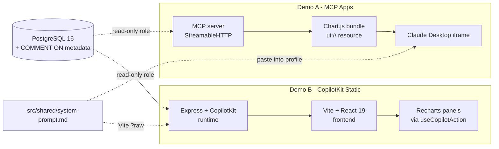

# Comparison — MCP Apps vs CopilotKit Static Generative UI

> Two ways to put an LLM in charge of charts, evaluated on the same database
> and the same five questions. This document is the headline output of
> `vehicle-genui-poc` v1.0.0.

Both demos answer the same golden-path questions over the same DVLA VEH0120
PostgreSQL schema. The only thing that varies is **how the LLM gets the
chart in front of the user**.

| | Demo A — MCP Apps (SEP-1865) | Demo B — CopilotKit Static AG-UI |
|---|---|---|
| Where the chart renders | Sandboxed iframe inside Claude Desktop | A `
` inside a Vite + React dashboard |
| Who runs the agent loop | Claude Desktop | A self-hosted Express runtime |
| Transport | MCP `StreamableHTTPServerTransport` over HTTP | GraphQL over HTTP via `@copilotkit/runtime` |
| Browser involved? | No (Claude Desktop is the host) | Yes (the dashboard *is* the host) |

---

## 1. What you had to build

Counts taken from `git ls-files src/ | xargs wc -l` on the v1.0.0 source tree.
"Lines" is a rough proxy for surface area, not a quality metric.

### Demo A — MCP Apps

| Category | Files | Lines | Representative paths |
|---|--:|--:|---|
| Server glue | 4 | ~289 | `server.ts` (232), `vite.config.ts`, `tsconfig.json`, `claude-desktop-config.json` |
| UI bundle (rendered inside Claude) | 3 | ~590 | `mcp-app.html` (63), `src/mcp-app.ts` (37), `src/chart-renderer.ts` (490) |
| Schema / DB role | 1 | 37 | `setup-readonly-role.sql` |
| Configuration | 1 | 32 | `package.json` |
| Docs | 1 | 166 | `src/demo-a-mcp-apps/README.md` |
| **Total (excl. lockfile)** | **10** | **~1,114** | |

### Demo B — CopilotKit Static AG-UI

| Category | Files | Lines | Representative paths |
|---|--:|--:|---|
| Runtime (Node, agent-host) | 7 | ~193 | `runtime/src/index.ts` (24), `runtime/src/copilotkit.ts` (42), `runtime/src/actions/queryVehicles.ts` (29), `runtime/src/verify-role.ts` (56), `runtime/src/db/pool.ts` (11), smoke scripts (31) |
| React components (charts + chat shell) | 11 | ~393 | `App.tsx` (53), `Dashboard.tsx` (39), `FuelBreakdownChart.tsx` (61), `TrendChart.tsx` (59), `TopMakesTable.tsx` (39), `Panel.tsx`, `ChartSkeleton.tsx`, `PromptInput.tsx`, `QueryChips.tsx`, `ErrorBoundary.tsx`, `main.tsx` |
| Frontend `useCopilotAction` tools (Generative UI) | 3 | ~115 | `useShowFuelBreakdown.tsx` (37), `useShowTrend.tsx` (44), `useShowTopMakes.tsx` (34) |
| Frontend state | 1 | 34 | `state/usePanels.ts` |
| Styles | 1 | 21 | `styles.css` (Tailwind v4) |
| Prompt loader | 1 | 15 | `prompt/system-prompt.ts` |
| Configuration | ~13 | ~169 | `pnpm-workspace.yaml`, two `package.json`s, two `tsconfig.json`s, `vite.config.ts`, `index.html`, `.env.example`, `.gitignore`, `vite-env.d.ts` |
| Schema / DB role | (shared with Demo A) | — | `setup-readonly-role.sql` re-applied |
| Docs | 1 | 84 | `src/demo-b-copilotkit/README.md` |
| **Total (excl. lockfiles)** | **~38** | **~1,024** | |

### Shared (both demos consume)

| Category | Files | Lines | Notes |
|---|--:|--:|---|
| ETL | 3 | ~449 | `src/etl/schema.sql` (226), `src/etl/etl.py` (220), `requirements.txt` (3) |
| Shared system prompt | 1 | 45 | `src/shared/system-prompt.md` — Demo A pastes into Claude's profile, Demo B loads via Vite `?raw` |

### Headline observation

The two demos are within **~10 % of each other** on raw lines of code (~1.1k
vs ~1.0k), but the **shape** is completely different:

- **Demo A** spends most of its budget on a single 490-line chart renderer
  that runs inside Claude. The server is small (232 lines).
- **Demo B** spreads its budget across **two processes** (runtime + frontend),
  three Generative-UI tool registrations, eleven React components, and a
  panel-store hook. No single file dominates.

Both demos own a `query_vehicles({ sql })` tool of roughly the same size
(~30 lines of glue around `pg.Pool.query`).

---

## 2. Control model

| Concern | Demo A — MCP Apps | Demo B — CopilotKit Static AG-UI |
|---|---|---|
| **UI assets** | Bundled into a single `dist/mcp-app.html` (Chart.js + renderer + HTML, ~510 KB) served as an `ui://` resource. | Live in the React app the developer ships; charts are normal `Recharts` components. |
| **Rendering surface** | Sandboxed iframe inside Claude Desktop (SEP-1865 host). | A `
` in the developer's own `<CopilotKit>`-wrapped React tree. |
| **Who runs the agent** | Claude Desktop (the user's Claude subscription) — the LLM is fully outside your code. | Your own Express runtime calls Anthropic's API; you own the system prompt, the tools, and the loop. |
| **State sync mechanism** | Tool result `{ structuredContent: { rows } }` is delivered to the iframe via `app.ontoolresult`; HITL via `app.sendMessage()`. | Frontend tools (`useCopilotAction`) execute *in the browser*; result writes to a `useSyncExternalStore`-backed panel store, React re-renders. |
| **Portability** | Renders in **any** SEP-1865 host (currently Claude Desktop / Claude.ai over Connectors). The same MCP server is reachable from anywhere over HTTP. | Renders only in the React app you built. Moving to a different framework = rewriting the frontend. |
| **UI customisation** | Bounded by what you can ship in a single bundled HTML resource (Chart.js + your CSS). No access to host theme, fonts, or interaction primitives. | Unbounded — it's just React. Tailwind v4, Recharts, your design system, motion library, anything. |
| **Design-system integration** | Effectively impossible — your bundle paints onto a sandboxed iframe with no parent CSS. | Trivial — share components, tokens, theme provider with the rest of the app. |

---

## 3. Developer experience

### Setup commands compared (objective)

| Step | Demo A | Demo B |
|---|---|---|
| Database | `docker compose up -d` + apply `schema.sql` + run ETL | (shared with Demo A) |
| Read-only role | `setup-readonly-role.sql` (one-time) | (shared) |
| Build | `npm install && npm run build` (singlefile bundle) | `pnpm install` (workspace) |
| Run | `npm run serve` (one process on :3001) | `pnpm --filter runtime dev` + `pnpm --filter frontend dev` (two processes) |
| Wire to host | Edit `claude_desktop_config.json` (location varies by Claude install) + paste system prompt into Claude profile + restart Claude Desktop | Open `http://localhost:5173` |
| API key | None (uses your Claude subscription) | Requires `ANTHROPIC_API_KEY` in `.env` |

### What broke during E2E (objective, observed in this repo's history)

These are the issues actually fixed during v0.2.0–v0.3.0 — see `CHANGELOG.md`
for the full list. They illustrate the failure surface of each approach.

**Demo A — MCP Apps:**
- Claude Desktop **caches `ui://` resources by URI.** Rebuilding the bundle
  did not refresh the iframe; we had to bump the URI through `v2`, `v3`,
  `v4` to bust the cache. Long-term mitigation is content-hash URIs.
- The Microsoft Store / **MSIX build of Claude Desktop reads its config
  from a sandboxed path** (`%LOCALAPPDATA%\Packages\Claude_pzs8sxrjxfjjc\…`),
  not the documented `%APPDATA%\Claude\…`. Discovered only by tailing logs.
- Cold `npx mcp-remote` exceeds Claude Desktop's 60 s init budget the first
  time — required `npm install -g mcp-remote` as a workaround.
- The default `command: "npx"` in config silently fails on Windows because
  Claude Desktop spawns commands without a shell — must be `npx.cmd`.
- Module-level `McpServer` singleton + `StreamableHTTPServerTransport` only
  worked for the first POST; every subsequent request 500ed with
  `Already connected to a transport`. Fixed by building a fresh server +
  transport per request.
- `node-postgres` returns `BIGINT` and aggregates over `BIGINT` as
  **JavaScript strings**, which broke the renderer's `typeof v === "number"`
  heuristic. Cost a debug session.
- Despite a 6.6 KB schema cheatsheet embedded in `instructions`, Claude
  still guessed `vehicles` / `makes` / `sales` because the cheatsheet was at
  the **bottom**. Reordering it to the top behind a `# AUTHORITATIVE SCHEMA`
  banner fixed it. **LLMs weight the start of system prompts heavily.**

**Demo B — CopilotKit Static AG-UI:**
- `useCopilotAction({ available: "frontend" })` routes to `useRenderToolCall`
  (render-only) — the LLM **cannot** invoke it. Removing the line was
  required to make charts respond to LLM tool calls.
- `@copilotkit/runtime` returned 404 against Anthropic until we matched the
  exact model id format expected by the adapter version.
- The runtime's BuiltInAgent vs custom agent runtime distinction is not
  obvious from the docs; we ended up on BuiltInAgent for v0.3.0.

### What surprised you (subjective — human-owned)

[FILL IN: human observations after running both demos. Suggested prompts:
what felt obviously better in each? Where did you get stuck longest?
What would you have expected to be easy that wasn't?]

### Rough time spent (subjective — human-owned)

[FILL IN: hours spent on each demo from first commit to first golden-path
answer end-to-end. Use the commit history as a reference if helpful.]

---

## 4. Overlap analysis

The **only** real overlap between Demo A and Demo B is the **PostgreSQL
database** and its **`COMMENT ON` documentation**.

### Where they share concepts

- **Same generic tool surface** — both demos expose exactly one tool to the
  LLM: `query_vehicles({ sql })`. No NL→SQL helpers. No per-question
  templates. This is a **constitution requirement** (Article III v1.1.0),
  not an accident.
- **Same prompt-engineering surface** — schema `COMMENT ON` strings are the
  only documentation the LLM sees about the database. Both demos point the
  LLM at the same shared system prompt.
- **Same hardened read-only Postgres role** (`vehicles_readonly`,
  `default_transaction_read_only=on`, `statement_timeout=10s`,
  allow-listed `SELECT` grants on four relations).

### Where they genuinely diverge

- **Transport.** MCP HTTP+SSE vs CopilotKit GraphQL.
- **Who owns the agent loop.** Demo A: Claude Desktop. Demo B: your runtime.
- **Where the chart is painted.** Demo A: an iframe in someone else's
  product. Demo B: a `
` you styled.
- **What "shipping a UI change" means.** Demo A: rebuild the bundle and
  bump the URI version. Demo B: hot-reload — the React component is just
  React.
- **What "shipping a tool change" means.** Demo A: edit `server.ts` and
  restart. Demo B: edit `useCopilotAction` in the frontend; HMR picks it up.
- **Cost model.** Demo A spends the user's Claude tokens. Demo B spends
  your Anthropic API key.
- **Distribution.** Demo A: register an MCP server, users add it to their
  Claude config. Demo B: deploy a web app.

---

## 5. When to use which

### Use **MCP Apps** when…

- Your users **already live in Claude Desktop / Claude.ai** and you want to
  put a domain capability inside their existing chat surface.
- You want to ship one server and have it work in **any** SEP-1865 host
  that emerges (Claude today, others tomorrow).
- You don't want to be on the hook for the LLM bill — the user's Claude
  subscription pays.
- Your UI needs are **bounded** (charts, tables, simple interactive
  widgets) and the iframe sandbox is fine.
- You don't have, and don't want, a frontend team.

### Use **CopilotKit Static AG-UI** when…

- You're building a **product** with its own URL, brand, design system, and
  navigation — and the AI surface is one capability among many.
- You need **deep design-system integration** (your fonts, your tokens,
  your component library, your motion).
- You want the agent to **drive complex application state** (filters,
  selections, multi-panel layouts) — not just render a chart.
- You can afford to host a runtime and pay for LLM calls directly.
- You want **full control of the agent loop** — your own system prompt,
  your own model choice, your own caching, your own observability.

### Use **either** when…

- You want the LLM to write SQL against a documented schema and render a
  chart from the result. Both approaches solve this case competently.

### Use **neither** when…

- You need a fixed, deterministic dashboard. An LLM in the loop is
  overkill — write the SQL once.

---

## 6. Community recommendation

If you're building **inside** an existing AI chat surface (Claude Desktop,
ChatGPT-style hosts as the SEP-1865 ecosystem grows), **MCP Apps** is the
clearer bet. You ship one HTTP endpoint plus a self-contained UI bundle;
the host runs the agent for free; portability comes built in. The trade-off
is that you live within the host's iframe — your "design system" is whatever
fits in 510 KB of bundled HTML.

If you're building **a product** — your own URL, your own users, your own
brand — **CopilotKit Static** is the more honest answer. You pay for the
LLM, you host the runtime, and you own the React app the user sees. In
exchange you get full design freedom, hot-reload during development, and
the ability to let the agent steer arbitrary application state, not just
render a chart.

The two are not really competitors. They answer different questions:
*"How do I extend Claude?"* vs *"How do I add an agent to my app?"* If you
catch yourself comparing them on the same axis, you're probably about to
build the wrong one.

> **Caveat:** SEP-1865 is in active development and Claude Desktop is the
> primary host today. CopilotKit's Static GenUI mode is stable but the
> runtime API is also evolving. Re-validate this recommendation every six
> months.
