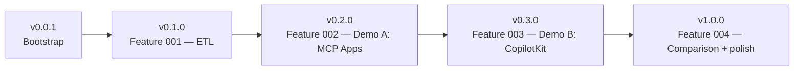

# Roadmap — vehicle-genui-poc

Each milestone ships an independently usable artefact and is tagged in Git.
Sequential prompts for each feature live in [specs/](../specs/).

## v0.0.1 — Bootstrap (current)

- Spec Kit SDD scaffold validated.
- Constitution in place.
- Empty source tree, docs, and slash commands ready.
- Repository tagged `v0.0.1`.

## v0.1.0 — Feature 001: ETL + schema

- PostgreSQL 16 via `docker compose up -d`.
- Python ETL (CPython 3.13+, `uv`) loads DVLA VEH0120 into the schema.
- Schema: `dim_vehicle`, `dim_period`, `fact_registrations`, `v_schema_summary`.
- Table comments populated — they are the LLM's only schema documentation.
- Spec prompt: [specs/prompt-02-feature-001-etl.md](../specs/prompt-02-feature-001-etl.md).

## v0.2.0 — Feature 002: Demo A (MCP Apps)

- FastMCP server wrapping `mcp-postgres`.
- Embedded HTML chart resources via Chart.js 4+.
- Spec prompt: [specs/prompt-03-feature-002-demo-a.md](../specs/prompt-03-feature-002-demo-a.md).

## v0.3.0 — Feature 003: Demo B (CopilotKit)

- Vite 6 + React 19 + TypeScript 5.8 + Tailwind v4 + Recharts 2.15.
- CopilotKit Static AG-UI surfacing the same data.
- Spec prompt: [specs/prompt-04-feature-003-demo-b.md](../specs/prompt-04-feature-003-demo-b.md).

## v1.0.0 — Feature 004: Comparison + polish

- Golden-path question set frozen.
- `docs/COMPARISON.md` published with scoring across the seven axes in
  [docs/PRD.md](PRD.md) §5.
- Repository ready for community release.
- Spec prompt: [specs/prompt-05-feature-004-comparison.md](../specs/prompt-05-feature-004-comparison.md).
