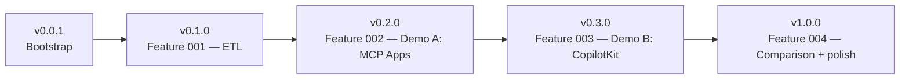

# Roadmap — vehicle-genui-poc

Each milestone ships an independently usable artefact and is tagged in Git.
Sequential prompts for each feature live in [specs/](../specs/).

## v0.0.1 — Bootstrap ✅

- Spec Kit SDD scaffold validated.
- Constitution in place.
- Empty source tree, docs, and slash commands ready.
- Repository tagged `v0.0.1`.

## v0.1.0 — Feature 001: ETL + schema ✅

- PostgreSQL 16 via `docker compose up -d`.
- Python ETL (CPython 3.14+, `uv`) loads DVLA VEH0120 into the schema
  (139,553 dim_vehicles · 82 periods · 19,666,224 facts).
- Schema: `dim_vehicle`, `dim_period`, `fact_registrations`, `v_schema_summary`.
- Table comments populated — they are the LLM's only schema documentation.
- Spec prompt: [specs/prompt-02-feature-001-etl.md](../specs/prompt-02-feature-001-etl.md).

## v0.2.0 — Feature 002: Demo A (MCP Apps) ✅

- TypeScript MCP server (`@modelcontextprotocol/sdk` + `@modelcontextprotocol/ext-apps`)
  on Express 5 / `StreamableHTTPServerTransport`, port 3001.
- Read-only Postgres role (`vehicles_readonly`) enforced at the database boundary.
- Single generic `query_vehicles({ sql })` tool — schema `COMMENT ON` is the only
  prompt surface (Constitution Article III v1.1.0).
- Bundled Chart.js 4 UI resource (`ui://vehicle/chart-renderer/mcp-app.html`)
  via `vite-plugin-singlefile`; column-shape ladder picks line / bar / donut /
  table renderer.
- Five golden-path queries verified end-to-end in Claude for Windows v1.6608
  (UWP / MSIX build) over a `cloudflared` quick tunnel. The MSIX build
  **does** load `claude_desktop_config.json`, but at a sandboxed path
  (`%LOCALAPPDATA%\Packages\Claude_pzs8sxrjxfjjc\LocalCache\Roaming\Claude\…`)
  — see `src/demo-a-mcp-apps/README.md` for the full wiring steps.
- Spec prompt: [specs/prompt-03-feature-002-demo-a.md](../specs/prompt-03-feature-002-demo-a.md).

## v0.3.0 — Feature 003: Demo B (CopilotKit) ✅

- pnpm workspace `src/demo-b-copilotkit/` with two packages:
  - **runtime/** — Express 5 + `@copilotkit/runtime` 1.57 + Anthropic
    adapter (Claude Sonnet 4.5). Generic `query_vehicles({ sql })` server
    action (Constitution Article III v1.1.0) backed by `lru-cache`
    (`max=200`, `ttl=1h`). Startup verifier asserts the
    `vehicles_readonly` role is hardened (`read_only=on`,
    `statement_timeout=10s`, allow-listed `SELECT` grants).
  - **frontend/** — Vite 7 + React 19 + Tailwind v4 + Recharts 3 dashboard
    with a `<CopilotKit>` provider, three Generative-UI panels
    (donut / line / horizontal bar), a `<CopilotPopup>` chat surface,
    and chips for the five golden-path queries.
- Shared system prompt at `src/shared/system-prompt.md` (single source of
  truth; both demos consume it — Demo A pastes it into Claude Desktop,
  Demo B loads it via Vite `?raw`).
- E2E verification (the five golden-path queries in chat) is gated on the
  user supplying `ANTHROPIC_API_KEY` — see
  `src/demo-b-copilotkit/README.md` for the manual checklist before
  tagging `v0.3.0`.
- Spec: [specs/feat-003-demo-b-copilotkit/](../specs/feat-003-demo-b-copilotkit/).
  (The original sequential prompt
  [specs/prompt-04-feature-003-demo-b.md](../specs/prompt-04-feature-003-demo-b.md)
  is **superseded** by the spec — it predates Constitution v1.1.0 and
  recommended `mcp-postgres`, which is no longer used.)

## v1.0.0 — Feature 004: Comparison + polish ✅

- Golden-path question set frozen (the same five questions in
  `README.md` § "Demo Script" and in both demo READMEs).
- `docs/COMPARISON.md` published with all six required sections, scoring
  both demos against the seven axes in [docs/PRD.md](PRD.md) §5.
- `README.md` carries a `## Demo Script` section so a reader can
  reproduce both demos side-by-side from a clean clone in ~15 minutes.
- All milestone tags published on `origin`: `v0.0.1`, `v0.1.0`,
  `v0.2.0`, `v0.3.0`, `v1.0.0`.
- Repository ready for community release.
- Spec: [specs/feat-004-comparison-and-polish/](../specs/feat-004-comparison-and-polish/).
  (The original sequential prompt
  [specs/prompt-05-feature-004-comparison.md](../specs/prompt-05-feature-004-comparison.md)
  remains as the historical brief.)
