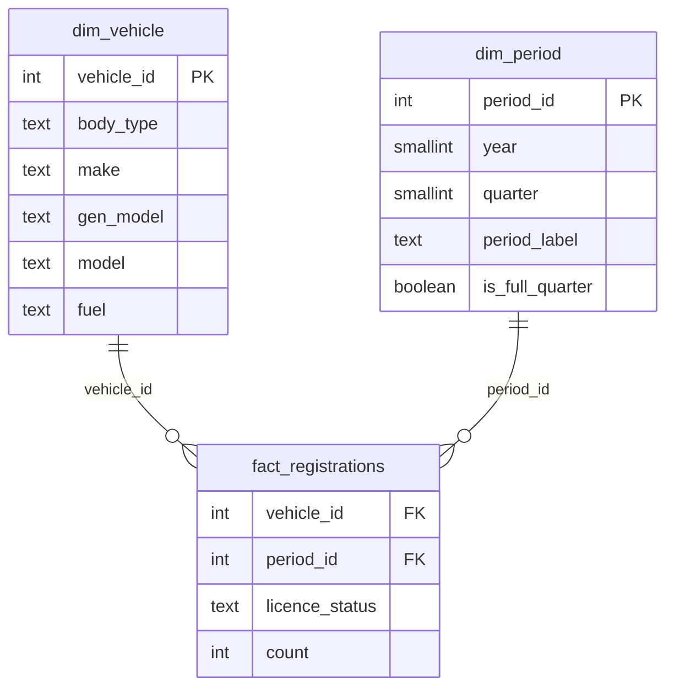
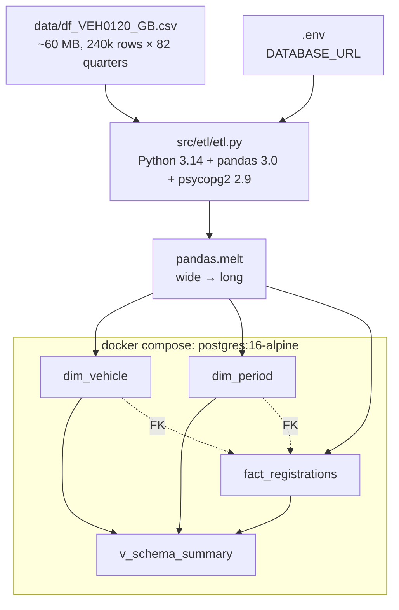

# Implementation Plan — Feature 001 — ETL + Postgres Schema

## Overview

Stand up a Dockerised PostgreSQL 16 instance, define a star schema heavily
documented for LLM consumption, and write an idempotent Python 3.14 ETL that
melts the DVLA VEH0120 wide CSV into that schema. Both demos (Features 002 and
003) consume this database via the standard `mcp-postgres` MCP server. The
schema's `COMMENT ON ...` statements are the only prompt-engineering surface
permitted by Article III.

## Architecture Decisions

| Decision | Choice | Rejected alternative | Rationale |
|---|---|---|---|
| ORM vs raw SQL | Raw SQL via psycopg2 | SQLAlchemy / Peewee | Constitution Article III forbids ORMs |
| CSV → schema strategy | `pandas.melt()` then bulk insert | Per-row INSERT loop | 60 MB / ~240k rows × 82 columns ≈ ~20M facts; needs batching |
| Batch insert mechanism | `psycopg2.extras.execute_values`, batch=5000 | `executemany`, `COPY FROM` | execute_values is the documented fast path for parameterised batched inserts; COPY skips ON CONFLICT and we need idempotency |
| Idempotency | `INSERT … ON CONFLICT DO NOTHING` | `TRUNCATE` then re-insert | Re-runs should be safe and fast even with partial data |
| Connection config | `DATABASE_URL` env var loaded from `.env` via python-dotenv | Hard-coded creds | 12-factor; matches what `mcp-postgres` will need in Features 002 / 003 |
| pgAdmin | Omit from compose | Include as service | User has pgAdmin 4 locally; spec resolution §2 |
| Postgres image | `postgres:16-alpine` | `postgres:16` (Debian) | ~80 MB smaller; no glibc dependency for our workload |
| Schema documentation | `COMMENT ON TABLE` and `COMMENT ON COLUMN` for everything | External docs | Article III: schema is the LLM's only documentation |
| Vehicle dim grain | `(body_type, make, gen_model, model, fuel)` — `licence_status` lives on the fact | Include `licence_status` on dim_vehicle | Same physical vehicle can be either Licensed or SORN; status changes don't define the vehicle |
| Period dim grain | `(year, quarter)` with derived `period_label` and `is_full_quarter` | Date-only fact column | Quarter is the natural grain in VEH0120; pre-computing label simplifies the LLM's downstream queries |

## Data Model Changes

This is a greenfield schema — no migration needed. Three tables plus one view.



**Constraints:**

- `dim_vehicle`: `UNIQUE (body_type, make, gen_model, model, fuel)` — drives ON CONFLICT
- `dim_period`: `UNIQUE (year, quarter)` — drives ON CONFLICT
- `fact_registrations`: `UNIQUE (vehicle_id, period_id, licence_status)` — drives ON CONFLICT; FKs to both dims

**View:** `v_schema_summary` — one row per dim/fact giving row count, distinct values for critical columns, and date coverage. Used by verification queries and exposed for LLM introspection.

## Directory Changes

```
docker-compose.yml            (new — repo root)
.env.example                  (new — repo root)
src/etl/
  schema.sql                  (new — DDL + COMMENTs + view + verification queries)
  etl.py                      (new — main ETL entry point)
  requirements.txt            (new — pinned deps)
  README.md                   (new — etl-specific run instructions)
README.md                     (updated — Mermaid ER + architecture, quick-start)
CHANGELOG.md                  (updated — [Unreleased] entry)
docs/ROADMAP.md               (updated — v0.1.0 row marked ✅)
```

No source files outside `src/`. Compose and `.env.example` are config, not source (Article I clause).

## Dependencies to Add

| Package | Version | Layer | Reason |
|---|---|---|---|
| Python | 3.14 | Runtime | Latest stable per Article IV |
| `psycopg2-binary` | `==2.9.12` | `src/etl/` | Postgres driver, raw SQL only |
| `pandas` | `==3.0.2` | `src/etl/` | CSV parsing + `melt()` |
| `python-dotenv` | `==1.2.2` | `src/etl/` | Loads `DATABASE_URL` from `.env` |
| `postgres:16-alpine` | latest 16.x | Docker image | Database |
| `uv` | latest (system) | Tooling | Python env management |

See [research.md](research.md) for version verification.

## Implementation Sequence

Order matches prompt-02 Step 6's priority sequence and is dependency-driven:
each task builds on the artefacts of the one before it.

1. **`docker-compose.yml` + `.env.example`** at repo root.
   `postgres:16-alpine`, single `db` service, port 5432 exposed, named volume
   `pgdata`. `.env.example` documents `POSTGRES_USER`, `POSTGRES_PASSWORD`,
   `POSTGRES_DB`, `DATABASE_URL`.

2. **`src/etl/schema.sql`** — full DDL + every `COMMENT ON …` + `v_schema_summary`
   view + verification queries as trailing SQL comments. Apply locally via
   `psql` and verify all comments came through (`\dt+`, `\d+ <table>`).

3. **`src/etl/requirements.txt`** with the three pinned deps from the table above.

4. **`src/etl/etl.py`** — main script. Pseudocode:
   - Load `.env`, read `DATABASE_URL` and `VEH0120_CSV` (default `data/df_VEH0120_GB.csv`)
   - `pandas.read_csv(...)` → wide DataFrame
   - Extract dim_vehicle: distinct `(body_type, make, gen_model, model, fuel)` → bulk upsert
   - Extract dim_period: parse the `YYYY QN` columns into `(year, quarter)` → bulk upsert
   - `df.melt(...)` to long format → join with dim IDs (single SQL JOIN at insert time, not pandas merge — keeps memory bounded) → bulk upsert into `fact_registrations`
   - Print row counts to stdout; exit 0 on success, 1 on any DB error
   - Use `psycopg2.extras.execute_values` with `page_size=5000` for all inserts

5. **Run `etl.py` locally** against the running container. Verify:
   - `SELECT COUNT(*) FROM dim_vehicle` matches distinct row count from CSV
   - `SELECT COUNT(*) FROM dim_period` matches the number of `YYYY QN` columns
   - `SELECT COUNT(*) FROM fact_registrations` ≈ rows × quarters (minus null cells)
   - Re-run ETL → second run is a no-op (idempotency check)

6. **Update `README.md`** — Mermaid diagrams (ER + architecture) already present
   from v0.0.1 polish; verify they match the implemented schema. Add quick-start
   steps that reference the actual ETL invocation (`uv run python etl.py`).

7. **Update `CHANGELOG.md` `[Unreleased]`** with the v0.1.0 changes.
   **Update `docs/ROADMAP.md`** marking v0.1.0 ✅.

8. **Open PR**, squash-merge to `main`, tag `v0.1.0`.

## Testing Approach

Per-task acceptance criteria sit in `tasks.md`. The high-level verification:

- **Schema:** `psql -f schema.sql` runs cleanly on an empty DB. `\d+ dim_vehicle`
  shows every column comment.
- **ETL:** runs end-to-end against the supplied CSV in under 5 minutes on a
  laptop. Second run prints zero new rows. Exits with code 0.
- **Verification queries** at the bottom of `schema.sql`:
  1. Row counts per table
  2. Distinct values per categorical column (`body_type`, `fuel`, `licence_status`)
  3. Period coverage (min `period_label`, max `period_label`, full-quarter count)
  4. Top 10 makes by total registrations (smoke test for fact correctness)
- **Idempotency:** run ETL twice; row counts should be identical after the second run.

No unit tests for this feature. The ETL is a one-shot batch process; integration
verification via the queries above is sufficient for a research PoC (Article VII).

## Architecture Diagram



## Constitution Compliance Check

- [x] **Article I — Source Layout:** all code under `src/etl/`. Compose and
      `.env.example` at repo root are config, not source.
- [x] **Article II — Demo Isolation:** ships only the shared DB; nothing
      demo-specific.
- [x] **Article III — No Custom Query Tools:** raw SQL via psycopg2 only. No
      ORM. Schema comments are the only prompt-engineering surface.
- [x] **Article IV — Latest Dependencies:** Python 3.14.4, psycopg2-binary
      2.9.12, pandas 3.0.2, python-dotenv 1.2.2, Postgres 16-alpine. All pins
      reflect the latest stable versions on 2026-05-07 (see research.md).
- [x] **Article V — Documentation-First:** spec → plan → tasks → code.
- [x] **Article VI — Mermaid-Only Diagrams:** all diagrams in this plan and
      in the README use Mermaid.
- [x] **Article VII — Simplicity:** no unit tests, no migrations framework, no
      orchestration layer. One script, one schema file, three tables.
- [x] **CHANGELOG entry planned** in implementation step 7.
