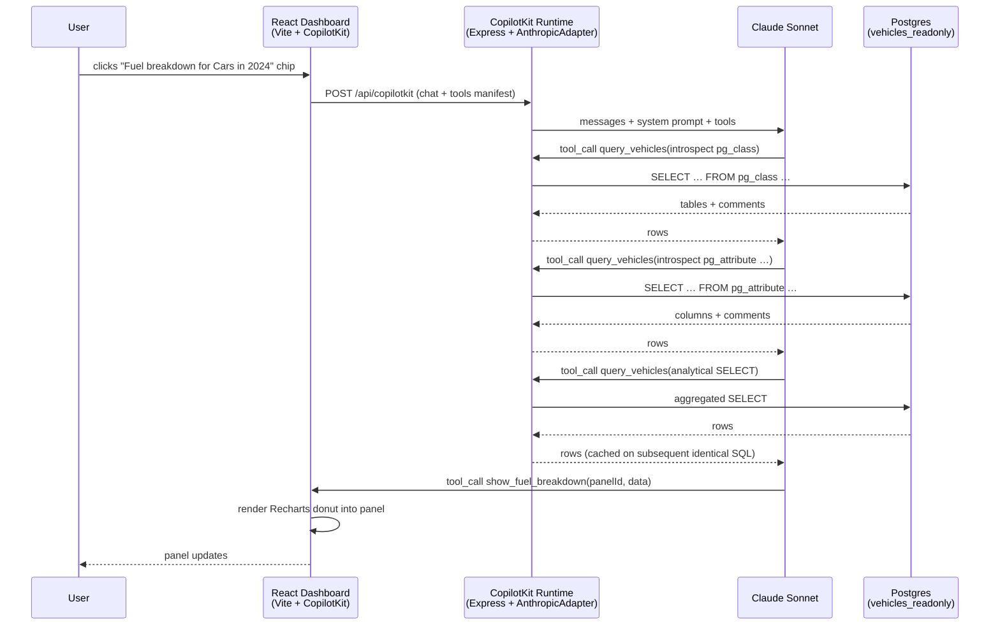

# Implementation Plan — Feature 003 (Demo B / CopilotKit)

## Overview

Build a Vite + React 19 dashboard in `src/demo-b-copilotkit/frontend/`
backed by a standalone Node + Express CopilotKit Runtime at
`src/demo-b-copilotkit/runtime/`. The runtime exposes one server
action `query_vehicles({ sql })` that runs raw SQL via `pg` against
the existing `vehicles_readonly` Postgres role and returns rows
through an LRU cache. The frontend pre-registers three Recharts
panels (`show_fuel_breakdown`, `show_trend`, `show_top_makes`) via
`useFrontendTool`; the LLM (Anthropic Claude Sonnet via
`@copilotkit/runtime`'s `AnthropicAdapter`) introspects schema via
`pg_catalog`, composes analytical SQL, then calls a frontend tool
to render a panel into a 12-column dashboard grid. A floating
`CopilotPopup` (collapsed by default) carries the chat surface.

## Architecture Decisions

| Decision                                | Choice                                            | Rejected                                | Rationale                                                                                                                  |
| --------------------------------------- | ------------------------------------------------- | --------------------------------------- | -------------------------------------------------------------------------------------------------------------------------- |
| LLM provider                            | Anthropic Claude Sonnet                           | OpenAI, Google, CopilotCloud            | Same model family as Demo A → comparison isolates the GenUI variable, not the model.                                       |
| Runtime hosting                         | Standalone Node + Express (`POST /api/copilotkit`) | Vite middleware, Next.js                | Documented CopilotKit Vite recipe; symmetrical two-process model with Demo A.                                              |
| Schema-prompt surface                   | Runtime `pg_catalog` introspection (same as Demo A) | Static `useCopilotReadable` schema blob | Constitution Article III v1.1.0: `COMMENT ON` is the only prompt surface. Hardcoded schema would re-create that surface.    |
| Result caching                          | `lru-cache` v11, max 200, 1h TTL, in-process      | Redis, Postgres `pg_stat_statements`    | Static dataset; PoC scope; no infra dep.                                                                                   |
| SQL execution role                      | Reuse `vehicles_readonly` (hardened in Feature 003 prep) | New role per demo                | Constitution Article II: demos share only the database. Allow-list grants + `read_only` + 10s `statement_timeout`.          |
| Package manager                         | pnpm 9+ workspaces                                | npm, single root                        | Frontend and runtime have disjoint deps; workspace lets each install minimally with one shared lockfile.                   |
| Frontend tool render contract           | `panelId` keyed; tool replaces panel content      | Append/stack panels                     | Matches prompt-04; deterministic layout for the 5 golden-path queries.                                                     |
| Loading state                           | `<ChartSkeleton />` during `status === 'inProgress'` | None / spinner only                  | CopilotKit `useFrontendTool` exposes `status`; cheap UX win.                                                              |

## Data Model Changes

**None.** Reuses `dim_vehicle`, `dim_period`, `fact_registrations`,
`v_schema_summary` from Feature 001. Reuses the `vehicles_readonly`
role (already hardened in this branch's commit `a09844b` +
`2b18084`).

## Directory Changes

```
src/demo-b-copilotkit/
├── README.md
├── pnpm-workspace.yaml
├── frontend/
│   ├── package.json
│   ├── vite.config.ts
│   ├── tsconfig.json
│   ├── index.html
│   ├── .env.example                 # VITE_COPILOT_RUNTIME_URL
│   └── src/
│       ├── main.tsx
│       ├── App.tsx                  # CopilotKit provider + layout
│       ├── styles.css               # Tailwind v4 entry
│       ├── components/
│       │   ├── Dashboard.tsx        # 12-col grid + panel router
│       │   ├── PromptInput.tsx      # Top text input
│       │   ├── QueryChips.tsx       # 5 example chips
│       │   ├── Panel.tsx            # Generic panel chrome
│       │   ├── ChartSkeleton.tsx
│       │   ├── FuelBreakdownChart.tsx
│       │   ├── TrendChart.tsx
│       │   └── TopMakesTable.tsx
│       ├── tools/
│       │   ├── useShowFuelBreakdown.ts
│       │   ├── useShowTrend.ts
│       │   └── useShowTopMakes.ts
│       ├── state/
│       │   └── usePanels.ts         # Zustand-style or React reducer
│       └── prompt/
│           └── system-prompt.ts     # Loads shared content
└── runtime/
    ├── package.json
    ├── tsconfig.json
    ├── .env.example                 # ANTHROPIC_API_KEY, DATABASE_URL, PORT
    └── src/
        ├── index.ts                 # Express bootstrap + CORS
        ├── copilotkit.ts            # Runtime + AnthropicAdapter wiring
        ├── actions/
        │   └── queryVehicles.ts     # The one tool + LRU
        ├── db/
        │   └── pool.ts              # pg.Pool against vehicles_readonly
        └── verify-role.ts           # Startup check: read_only + timeout
```

System-prompt content is shared with Demo A — `frontend/src/prompt/system-prompt.ts` reads/inlines `src/demo-a-mcp-apps/system-prompt.md` at build time (Vite `?raw` import) so both demos use byte-identical schema-introspection guidance.

## Dependencies to Add

### Frontend (`src/demo-b-copilotkit/frontend/package.json`)

| Package                      | Version  | Reason                                         |
| ---------------------------- | -------- | ---------------------------------------------- |
| `@copilotkit/react-core`     | ^1.57.1  | Provider, hooks, `useFrontendTool`             |
| `@copilotkit/react-ui`       | ^1.57.1  | `CopilotPopup`                                 |
| `@copilotkit/runtime-client-gql` | ^1.57.1 | gql client to runtime                       |
| `react`                      | ^19.2.6  |                                                |
| `react-dom`                  | ^19.2.6  |                                                |
| `recharts`                   | ^3.8.1   | Charts                                         |
| `vite`                       | ^8.0.11  | Dev server + build                             |
| `@vitejs/plugin-react`       | latest   | React fast refresh                             |
| `typescript`                 | ^6.0.3   |                                                |
| `tailwindcss`                | ^4.3.0   | Styling                                        |
| `@tailwindcss/vite`          | ^4.3.0   | v4 Vite plugin                                 |

### Runtime (`src/demo-b-copilotkit/runtime/package.json`)

| Package                      | Version  | Reason                                          |
| ---------------------------- | -------- | ----------------------------------------------- |
| `@copilotkit/runtime`        | ^1.57.1  | Runtime + Anthropic adapter                     |
| `@anthropic-ai/sdk`          | latest   | Required by `AnthropicAdapter`                  |
| `express`                    | ^5.2.1   | HTTP server                                     |
| `cors`                       | ^2.8.6   | Allow `http://localhost:5173` origin            |
| `pg`                         | ^8.20.0  | Postgres client (no ORM)                        |
| `lru-cache`                  | ^11.3.6  | Tool-level result cache                         |
| `dotenv`                     | ^17.4.2  | `.env` loading                                  |
| `tsx`                        | ^4.21.0  | TS execution in dev                             |
| `typescript`                 | ^6.0.3   |                                                 |

## Implementation Sequence

Strictly bottom-up so each layer can be smoke-tested in isolation
(prompt-04 Step 5 priority).

1. **Workspace scaffold** — `pnpm-workspace.yaml`, two `package.json`
   files, `tsconfig.json` baseline, `.env.example` files,
   `README.md` skeleton.
2. **Runtime: `db/pool.ts` + `verify-role.ts`** — connects as
   `vehicles_readonly`, asserts `current_setting('transaction_read_only') = 'on'`
   and `statement_timeout = '10s'` at startup; logs grants.
3. **Runtime: `actions/queryVehicles.ts`** — `pg.query` + LRU wrap.
   Smoke-tested with `curl`-style script before CopilotKit wiring.
4. **Runtime: `copilotkit.ts` + `index.ts`** — Express server,
   CORS, CopilotKit Runtime mounted at `/api/copilotkit`,
   `AnthropicAdapter`, registers the action.
5. **Frontend scaffold** — Vite + React + Tailwind v4 boots; empty
   12-column grid; PromptInput + QueryChips render but inert.
6. **Frontend chart components** — `FuelBreakdownChart`, `TrendChart`,
   `TopMakesTable`, `ChartSkeleton` rendered standalone with hardcoded
   props (Storybook-style ad-hoc page) to verify Recharts.
7. **Frontend tool hooks** — three `useFrontendTool` registrations
   wired to a panel reducer (`usePanels`); test with mocked
   `runtimeUrl` and a script that POSTs synthetic tool calls.
8. **End-to-end wire** — `CopilotKit` provider points at runtime;
   `useCopilotReadable` injects shared system prompt; `CopilotPopup`
   mounted; chip click pushes the question into the chat surface.
9. **Five golden-path verification** — manual run of each chip; if
   the LLM picks the wrong frontend tool, refine the system prompt
   only (no per-question helpers).
10. **Docs & release plumbing** — `README.md`, CHANGELOG `[Unreleased]`,
    `docs/ROADMAP.md` v0.3.0 marker.

## Testing Approach

The PoC remains test-light by design (Constitution Article V — PoC
not Product). Verification per layer:

- **Runtime contract:** a Node script `runtime/scripts/smoke.ts`
  that POSTs introspection + analytical SQL through the
  `query_vehicles` action and asserts row shapes; runnable via
  `pnpm tsx scripts/smoke.ts`.
- **Role hardening:** `verify-role.ts` is the test — runtime refuses
  to start if `read_only` or `statement_timeout` are not set.
- **Chart components:** rendered standalone in a dev-only
  `/playground` route with hardcoded sample data.
- **End-to-end:** the five golden-path query chips constitute the
  acceptance test (spec.md milestone gate). Pass = each chip yields
  the expected panel.

No unit-test framework added. If a future feature needs Vitest, that
is a separate decision.

## Mermaid Diagram



## Constitution Compliance Check

- [x] All source code in `src/demo-b-copilotkit/`
- [x] No ORM — raw SQL via `pg`, parameterised only when the
      runtime itself constructs SQL (it doesn't; the LLM owns SQL
      composition)
- [x] No custom NL→SQL helpers; one generic `query_vehicles({ sql })`
      tool only
- [x] Demo isolation maintained — Demo B shares only the database
      (and a build-time read of Demo A's `system-prompt.md`)
- [x] Latest dependency versions (see `research.md`)
- [x] CHANGELOG entry planned in step 10
- [x] Mermaid diagrams used (no ASCII)
