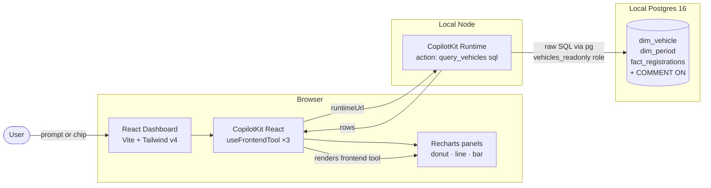

# Feature 003 — Demo B: CopilotKit Static GenUI Dashboard

## GitHub Issues

Closes #13, #14, #15, #16.

## Problem Statement

`vehicle-genui-poc` compares two Generative UI approaches over the same UK
DVLA VEH0120 dataset. Demo A (shipped in v0.2.0) demonstrates **MCP Apps**:
the LLM emits a UI resource URI that the host renders inside a sandboxed
iframe driven by tool output.

Demo B must demonstrate the contrasting **CopilotKit Static AG-UI** approach:
the LLM does **not** emit UI; instead the developer pre-registers React
components on the frontend, and the LLM calls them as tools with structured
arguments. The dashboard owns the layout; the LLM owns chart selection and
data parameters.

The two demos must read the same database and answer the same five
golden-path questions, so the resulting comparison document can score them
on a like-for-like basis.

## User Stories

- **As a researcher** evaluating GenUI approaches, I want to ask "Fuel
  breakdown for Cars in 2024" in a CopilotKit dashboard and see a Recharts
  donut panel render in-place, so I can compare the developer ergonomics
  and LLM behaviour against Demo A's iframe-bundled output.
- **As a contributor** trying both demos locally, I want to run
  `pnpm dev` in `src/demo-b-copilotkit/frontend/` and have the dashboard
  reach my local Postgres without any additional backend service to
  install or configure beyond what Demo A already needed (Postgres + read-only
  role).
- **As the comparison author**, I want the same five golden-path queries
  to drive both demos so the resulting `docs/COMPARISON.md` rates them on
  identical inputs.

## Acceptance Criteria

### Stack and structure

- [ ] All Demo B source lives under `src/demo-b-copilotkit/` (no files
      outside that path).
- [ ] Frontend at `src/demo-b-copilotkit/frontend/` uses Vite 6, React 19,
      TypeScript 5.8+, Tailwind v4, Recharts 2.15+, `@copilotkit/react-core`
      and `@copilotkit/react-ui` (latest), pnpm.
- [ ] CopilotKit Runtime backend at `src/demo-b-copilotkit/runtime/`
      (Node + `@copilotkit/runtime`, latest) hosts a single server-side
      action `query_vehicles({ sql: string })` that executes raw SQL via
      `pg` against the `vehicles_readonly` Postgres role and returns rows.
- [ ] Both processes start with one command each: `pnpm dev` (frontend) and
      `pnpm start` (runtime). Frontend env var
      `VITE_COPILOT_RUNTIME_URL` points at the runtime endpoint
      (default `http://localhost:4001/api/copilotkit`).

### Constitution Article III v1.1.0 — Schema-First, LLM-Writes-SQL

- [ ] The runtime exposes **exactly one** generic data tool:
      `query_vehicles({ sql: string }) → { rows: [...] }`. No
      question-specific helpers, no NL→SQL templates, no ORM. Reuses the
      same `vehicles_readonly` role created in Feature 002.
- [ ] Schema introspection is the LLM's only prompt-engineering surface.
      The system prompt (via `useCopilotReadable`) instructs the LLM to
      query `pg_catalog.pg_description` / `information_schema` to discover
      tables, columns, and `COMMENT ON` text before composing analytical
      SQL. **No example SQL or column lists are hardcoded into the prompt
      or the runtime.**
- [ ] No frontend tool ever ships SQL. Frontend tools accept already-shaped
      data arrays (e.g., `{ fuel: string, count: number, percentage:
      number }[]`) — the LLM is responsible for shaping the SQL output
      into the agreed argument schema.

### Frontend tools (rendering only)

- [ ] Three `useFrontendTool` registrations:
  - `show_fuel_breakdown(panelId, data: { fuel, count, percentage }[])` →
    `FuelBreakdownChart` (Recharts donut, fuel-colour palette matching Demo A:
    electric green, hybrid blue, petrol/diesel grey, gas amber, other light
    grey).
  - `show_trend(panelId, title, series: { name, points: { x, y }[] }[])` →
    `TrendChart` (Recharts `LineChart` with optional area).
  - `show_top_makes(panelId, data: { make, count }[])` → `TopMakesTable`
    (Recharts horizontal `BarChart`).
- [ ] Each frontend tool renders into a dashboard panel by `panelId`
      (replaces previous content for that panel ID, never stacks).
- [ ] Each frontend tool shows `<ChartSkeleton />` while
      `status === "inProgress"`.
- [ ] Each component is verified in isolation with hardcoded sample data
      props **before** the CopilotKit wiring is added (per
      prompt-04 Step 5 priority sequence).

### Dashboard layout (no persistent chat window)

- [ ] Top of page: single text input
      (placeholder *"Ask about UK vehicle registrations…"*).
- [ ] Below input: horizontally scrollable row of **five example query
      chips** matching the v0.2.0 golden-path queries.
- [ ] Main area: 12-column CSS grid; panels snap to 4 / 6 / 8 / 12 column
      widths chosen by chart type (donut → 4, bar → 6, line → 8, table → 12).
- [ ] Floating bottom-right `<CopilotPopup />`, **collapsed by default**.
- [ ] "Agent is working…" spinner shown while a tool call is in flight.

### Defence-in-depth (shared role hardening)

- [ ] Demo B's runtime connects via the same `vehicles_readonly` role
      hardened in Feature 003: `SELECT` granted only on the four
      whitelisted relations (`dim_vehicle`, `dim_period`,
      `fact_registrations`, `v_schema_summary`); blanket
      `GRANT ALL ON ALL TABLES` and `ALTER DEFAULT PRIVILEGES` are
      explicitly *revoked* so future migrations cannot silently expose
      new tables to the LLM. Plus role-level
      `default_transaction_read_only = on` and `statement_timeout = 10s`.
      No code change needed in Demo B — verified by the role's
      `pg_catalog` config at runtime startup.

### Tool-level result caching

- [ ] Demo B's `query_vehicles` server action wraps `pg.query` in an
      in-process LRU keyed by the trimmed SQL string (e.g.,
      `lru-cache`, `max: 200`, `ttl: 1h`). Returns
      `{ rows, cached: boolean }` so the comparison doc can show
      cache-hit telemetry. No SQL normalisation — raw string keys only.
      Cache resets on process restart (acceptable for the PoC; ETL
      re-runs require a runtime restart anyway).

### End-to-end verification (milestone gate, #16)

All five queries trigger the correct frontend tool and render the correct
panel:

- [ ] *"Fuel breakdown for Cars in 2024"* → donut panel
- [ ] *"EV growth trend since 2015"* → line panel
- [ ] *"Top 10 makes by licensed vehicles"* → bar panel
- [ ] *"Licensed vs SORN for motorcycles over time"* → multi-series line panel
- [ ] *"Which fuel type grew fastest in the last 5 years?"* → line OR donut
      panel (whichever shape the LLM's SQL produces is acceptable)

### Release plumbing

- [ ] `CHANGELOG.md` `[Unreleased]` entry describing Feature 003.
- [ ] `docs/ROADMAP.md` v0.3.0 marked ✅ with what shipped.
- [ ] `src/demo-b-copilotkit/README.md` covers install, env, both processes,
      and the five golden-path queries.
- [ ] PR squash-merged to `main`; tag `v0.3.0` on the merge commit.

## Out of Scope

- Authentication / multi-user — both demos remain single-user local PoCs.
- Persisting dashboard state across page reloads (panels start empty each load).
- Streaming partial chart updates (each tool call replaces panel atomically).
- Mobile-responsive layout (desktop only — sufficient for the comparison).
- Replacing Demo A or sharing components across demos (Constitution
  Article II — Demo Isolation).
- Productionising the runtime (CORS hardening, rate limiting, observability).

## Dependencies

- **Feature 001** (ETL + schema with `COMMENT ON` statements) — must be
  loaded; the LLM relies on these comments via `pg_catalog`.
- **Feature 002 — `vehicles_readonly` Postgres role** (already created in
  v0.2.0) — Demo B reuses this role rather than creating its own. The
  read-only constraint is enforced at the database layer, not in the
  runtime code.
- Postgres 16 reachable on `localhost:5432` (`docker compose up -d`).
- Node 22 LTS, pnpm 9+.

## Constitution Compliance

- [x] All source code in `src/demo-b-copilotkit/`
- [x] Demo isolation maintained — Demo B shares only the database +
      `src/shared/` with Demo A; no code crosses demo boundaries.
- [x] **Article III v1.1.0:** Demo B owns one generic
      `query_vehicles({ sql })` server action via the canonical CopilotKit
      Runtime. Schema `COMMENT ON` is the LLM's only prompt surface. No
      NL→SQL templates. No ORM. **This deliberately departs from
      `specs/prompt-04-feature-003-demo-b.md`, which predates the v1.1.0
      amendment and called for `mcp-postgres` + `McpServerManager`. The
      constitution supersedes the prompt.**
- [x] Latest dependency versions used (resolved during `/speckit.plan`
      research phase).
- [x] CHANGELOG.md updated in the PR.
- [x] Mermaid diagrams used (no ASCII).

## Architecture sketch

## Open clarifications

None for now. The deliberate departure from prompt-04 (CopilotKit Runtime
+ own `query_vehicles` action instead of `mcp-postgres` +
`McpServerManager`) is recorded above under *Constitution Compliance* and
will be revisited in `/speckit.plan` if the canonical CopilotKit pattern
makes a different choice optimal — in which case any change must still
satisfy Article III v1.1.0 (one generic SQL tool per demo, schema as the
only prompt surface).
