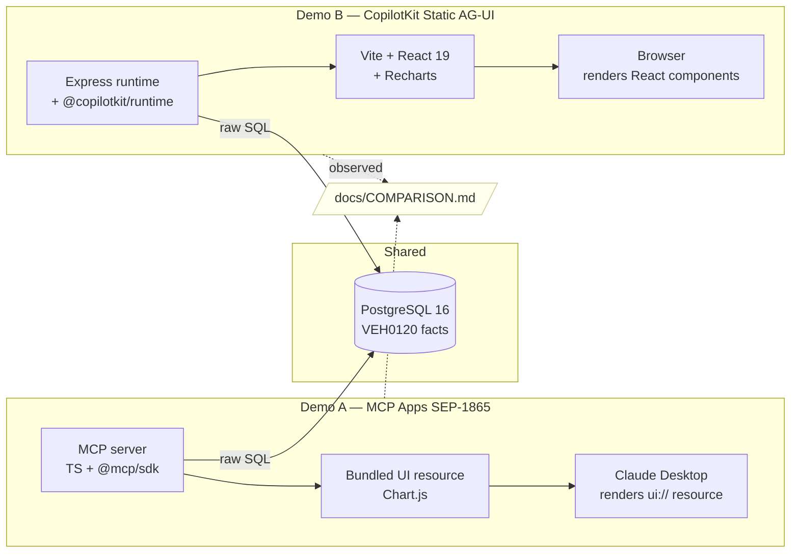

# Implementation Plan — Feature 004

## Overview

Documentation-only feature that produces the project's headline deliverable
(`docs/COMPARISON.md`), finalises the README with a reproducible Demo Script,
and locks `CHANGELOG.md` + `docs/ROADMAP.md` for the v1.0.0 release. No `src/`
code is touched. Evidence for COMPARISON.md is gathered by direct file
inspection of both demos (file counts, line counts, dependencies) and by
running each demo against the golden-path question set.

## Architecture Decisions

- **No src/ changes.** This feature is pure documentation and release
  bookkeeping. Any code change uncovered during writing is out of scope and
  must become a separate fix branch.
- **Evidence-first writing.** Every claim in COMPARISON.md must be backed by
  either (a) a file path + line count from `git ls-files | xargs wc -l` style
  measurement, (b) a `package.json` / `pyproject.toml` version, or (c) a
  reproducible observation from running a demo. No vibes-based comparisons.
- **Human placeholder strategy.** Section 3 ("Developer experience") of
  COMPARISON.md will include explicit `[FILL IN: human observations]` markers
  for the subsections that require lived author experience (rough time spent,
  what surprised the human author). The agent fills the objective parts
  (setup commands, files touched, error messages encountered during E2E).
- **Mermaid only.** No ASCII diagrams. Any diagram added (e.g., a
  control-model diagram in COMPARISON.md, or a "how the demos relate"
  diagram in README) is Mermaid.
- **README Demo Script lives in README.md, not a separate doc.** A reader
  cloning the repo should not have to navigate to find reproduction steps.

## Data Model Changes

None.

## Directory Changes

```
docs/
  COMPARISON.md       (NEW — six sections per spec)
README.md             (EDIT — add "Demo Script" section + verify Mermaid)
CHANGELOG.md          (EDIT — promote [Unreleased] to [v1.0.0])
docs/ROADMAP.md       (EDIT — mark v1.0.0 items ✅)
```

No additions or changes under `src/`.

## Dependencies to Add

| Package | Version | Layer | Reason |
| ------- | ------- | ----- | ------ |
| _(none)_ | — | — | Documentation-only feature |

## Implementation Sequence

1. **Evidence gathering.** Walk `src/` and capture file inventory + line
   counts per demo, grouped by category (schema / UI assets / React
   components / configuration / glue code). Capture into the eventual
   COMPARISON.md table.
2. **Read both `package.json` files + Python `pyproject.toml`** to capture
   exact dependency versions.
3. **Run both demos against the golden-path question set.** Note any
   observable behaviour differences (latency feel, error recovery, UI
   polish, what the LLM had to "guess"). These feed Section 3 (objective
   parts) and Section 4 (overlap analysis).
4. **Write `docs/COMPARISON.md` — sections 1, 2, 4, 5, 6** (objective +
   opinionated-but-grounded). Section 3 gets a skeleton with `[FILL IN]`
   markers for human-only subsections.
5. **Write README "Demo Script" section.** Step-by-step: clone → docker
   compose → ETL → start Demo A → run golden questions → start Demo B →
   run same golden questions → talking points at each step.
6. **Verify all Mermaid diagrams** in README.md and `docs/` render on
   GitHub (visual check via `gh browse` or by pushing the branch and
   inspecting on github.com).
7. **Promote `[Unreleased]` → `[v1.0.0] — <date>`** in CHANGELOG.md. Add a
   short summary line for the comparison document itself.
8. **Mark v1.0.0 items ✅** in `docs/ROADMAP.md`.
9. **Open PR** using project PR template; closes #18, #19, #20, #21.
10. **After merge:** tag `v1.0.0` on `main` and push.

## Testing Approach

- **Acceptance check** (manual): walk through the spec's acceptance criteria
  one by one and tick each box. The criteria are themselves the test plan.
- **Mermaid render check**: push branch, view changed Markdown files on
  github.com to confirm diagrams render.
- **Source-isolation check**:
  ```pwsh
  git ls-files | Where-Object {
    ($_ -match '\.(py|tsx?|jsx?)$') -and
    ($_ -notmatch '^(src/|node_modules/|\.specify/|specs/)')
  }
  ```
  Must return zero rows.
- **Tag verification**:
  ```pwsh
  git tag --list | Sort-Object
  ```
  Must include v0.0.1, v0.1.0, v0.2.0, v0.3.0, v1.0.0.
- **Demo reproducibility**: a second human (or the agent in a clean shell)
  follows README Demo Script verbatim and both demos answer the golden
  questions correctly.

## Mermaid Diagram



## Constitution Compliance Check

- [x] All source code in `src/` — no `src/` changes.
- [x] No ORMs — no DB code touched.
- [x] No custom query tools — Article VI not engaged.
- [x] Demo isolation maintained — comparison only describes both demos; no
      shared code introduced.
- [x] Latest versions used — no dependency changes; existing versions
      verified in `research.md`.
- [x] CHANGELOG entry planned — explicit step in Implementation Sequence.
